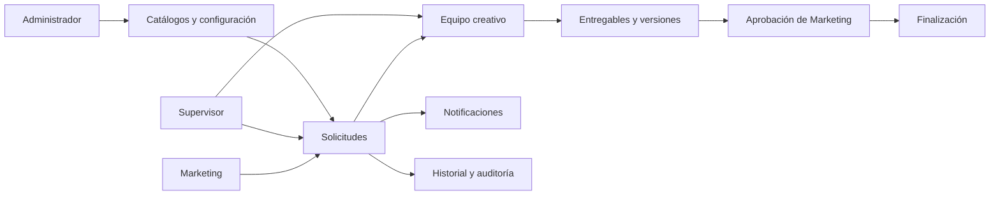

# 1. Visión del producto

## Resumen ejecutivo

TG Creative Hub es una plataforma interna especializada para que Marketing solicite y dé seguimiento a trabajo de Diseño Gráfico, Video y Render / Modelado 3D. Sustituye Excel, correos, mensajes y archivos dispersos por un flujo trazable de brief, asignación, producción, revisión, correcciones y aprobación.

No es CRM, ERP, mesa de ayuda, gestor de incidencias ni sistema de tickets general.

## Problema y oportunidad

Las solicitudes llegan incompletas, el contexto se fragmenta y el equipo pierde tiempo buscando archivos o confirmando prioridades. El producto debe convertir una necesidad de Marketing en una solicitud clara en menos de dos minutos y permitir que un creativo entienda el trabajo sin depender de canales externos.

## Resultados esperados

| Resultado | Señal de éxito futura |
|---|---|
| Briefs completos | Menos solicitudes devueltas por falta de información |
| Trazabilidad | Cada cambio, comentario, archivo y decisión tiene autor y fecha |
| Flujo controlado | Los estados solo cambian por transiciones válidas |
| Visibilidad | Marketing conoce avance y próximos pasos |
| Capacidad | Supervisión puede ver carga y reasignar con criterio |

## Principios UX

1. Claridad antes que decoración.
2. Una acción principal por pantalla.
3. Progresión visible y formularios progresivos.
4. Contenido y acciones adaptados al rol.
5. Estados comprensibles sin depender únicamente del color.
6. Feedback inmediato, recuperación ante errores y guardado automático.
7. Confirmación para acciones destructivas o irreversibles.
8. Privacidad por defecto: el usuario solo ve lo que necesita.

## Mapa general

## Fuera de alcance

Login personalizado, dashboard final, CRUD, base de datos de negocio, paneles implementados, reportes funcionales, integraciones, IA y aplicación móvil.
