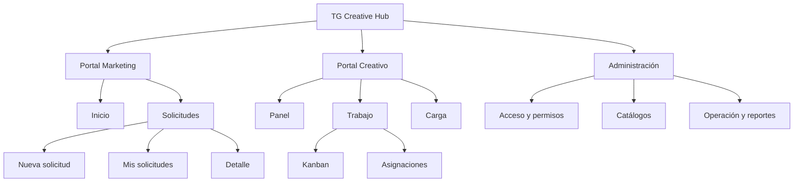
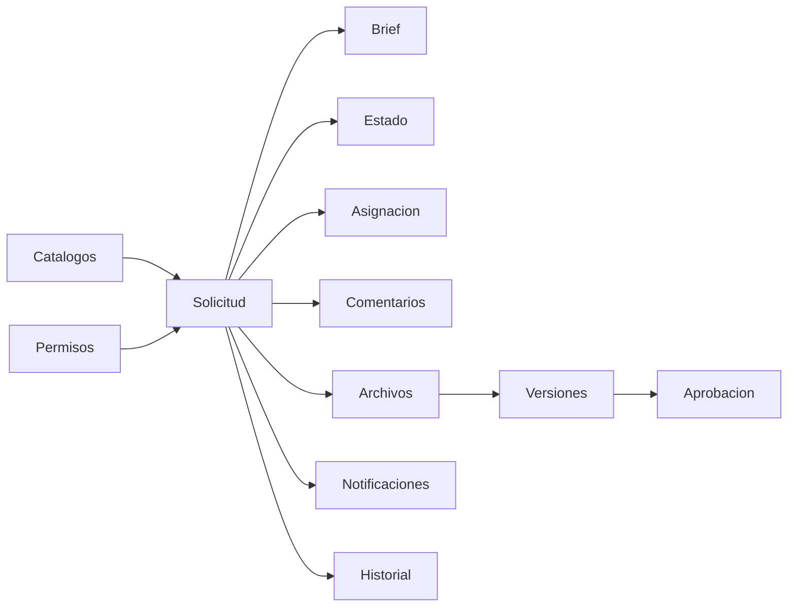

# 3. Arquitectura de información

## Jerarquía

## Entidades conceptuales

- Usuario: identidad, rol, departamento, estado activo.
- Solicitud: folio, servicio, brief, estado, prioridad, fechas y relaciones.
- Comentario: compartido o nota interna, con autor y contexto.
- Archivo: referencia, brief, avance, entregable o final.
- Versión: conjunto de entregables asociado a una revisión.
- Catálogo: servicio, tipo, categoría, prioridad, estado, plantilla.
- Evento: cambio relevante para historial y auditoría.

## Jerarquía de contenido del detalle

1. Encabezado: folio, título, estado, prioridad y fecha requerida.
2. Próxima acción y responsable.
3. Brief resumido y campos específicos del servicio.
4. Entregables/versiones y revisión.
5. Archivos y referencias.
6. Comentarios compartidos; notas internas separadas.
7. Historial y metadatos.

## Relación entre módulos

## Estados de interfaz

Cada módulo debe especificar carga, vacío, error, éxito y sin permisos. Un vacío debe explicar qué significa y ofrecer una acción; un error debe permitir reintentar; la carga debe preservar el contexto y evitar saltos de layout.
