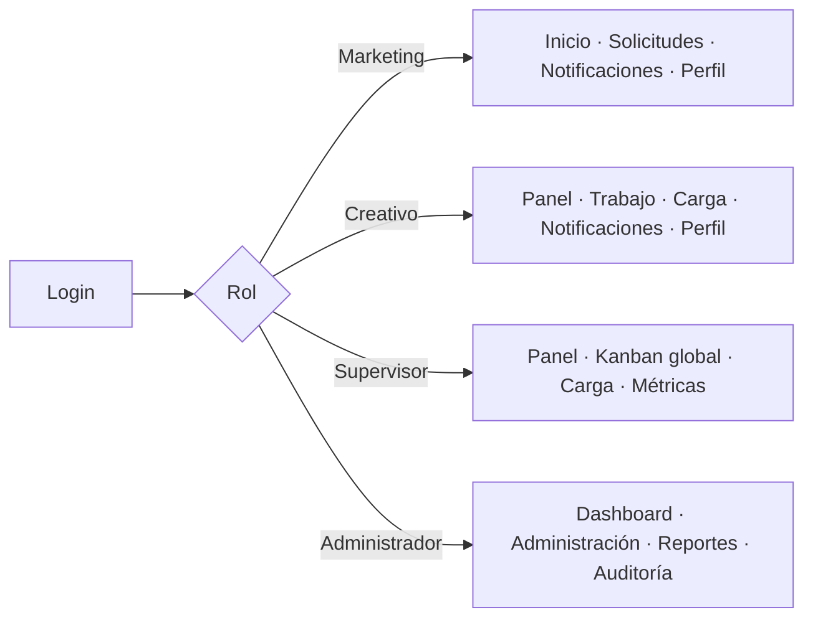

# 5. Navegación y reglas

## Navegación por rol



## Reglas

1. El menú solo muestra módulos autorizados; la URL también se valida en backend.
2. El logotipo lleva al inicio del portal actual, no cambia de rol.
3. La acción primaria permanece visible; acciones peligrosas quedan separadas y confirmadas.
4. Un breadcrumb refleja ubicación: `Inicio / Solicitudes / TG-000123 / Entregables`.
5. El detalle conserva filtros y contexto al volver a una lista.
6. Los filtros se pueden limpiar; no se ocultan resultados por un filtro invisible.
7. Kanban y lista representan el mismo conjunto; cambiar de vista no cambia datos.
8. Las notificaciones llevan al contexto exacto y marcan leído al abrir, salvo preferencia futura.
9. Estados y permisos se expresan con texto, icono y color secundario.

## Rutas conceptuales

```text
/login
/marketing
/marketing/requests/new/{service}/{step}
/marketing/requests
/marketing/requests/{folio}
/creative
/creative/board
/creative/requests/{folio}
/admin
/admin/{module}
/notifications
/profile
```

## Estados vacíos y errores

- Sin solicitudes: explicar que aún no hay trabajo y mostrar “Crear solicitud”.
- Sin asignaciones: explicar que no hay trabajo asignado, sin sugerir error.
- Sin permiso: mostrar mensaje genérico, sin revelar existencia de la entidad.
- Error de red: conservar entradas, mostrar reintentar y registrar referencia técnica.
