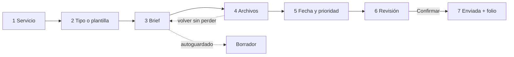

# 6. Flujo de creación de solicitud

## Wizard

## Reglas de experiencia

- Barra de progreso con paso actual y pasos completados.
- Autoguardado al cambiar de paso y periódicamente; mostrar hora del último guardado.
- “Guardar borrador” disponible siempre después del primer paso.
- Atrás conserva la información; salir advierte solo si hay cambios pendientes.
- Cada paso valida lo necesario para avanzar, sin bloquear información opcional.
- El envío requiere confirmación y genera folio único.

## Obligatorio vs opcional

Obligatorio para enviar: servicio, tipo, título, descripción/objetivo, fecha requerida, solicitante y departamento. Al menos una referencia o archivo se recomienda, pero no se exige salvo plantilla que lo indique. Prioridad solicitada es opcional y queda sujeta a validación del supervisor.

## Campos condicionales

| Servicio | Campos específicos |
|---|---|
| Diseño Gráfico | Tipo de pieza, tamaño, formato, canal, texto final; impresión, propuestas y requerimientos técnicos según selección |
| Video | Tipo, duración, formato, canal, guion, grabación, locación, voz, música, resolución |
| Render 3D | Tipo, producto/espacio, medidas, ángulos, detalle, archivos técnicos, materiales, fondo, resolución, vistas |

No mostrar campos irrelevantes. Una plantilla puede marcar campos adicionales como obligatorios, siempre explicando por qué.

## Revisión y recuperación

La revisión resume datos por sección con “Editar”. Si falla el envío, el borrador permanece y se permite reintentar sin duplicar solicitud. Al finalizar: folio, estado Pendiente, fecha de recepción y próximos pasos.
