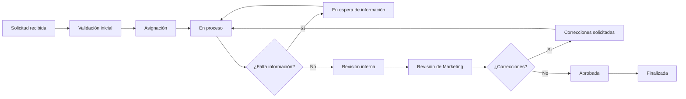

# 7. Flujo de atención creativa

## Etapas y responsables

| Etapa | Responsable | Acción / evidencia |
|---|---|---|
| Recepción | Sistema | Crea folio, notifica y conserva fecha |
| Validación | Supervisor o creativo autorizado | Comprueba alcance, datos y servicio |
| Asignación | Supervisor | Define responsable y fecha operativa |
| Producción | Creativo | Actualiza avance, archivos y comentarios |
| Espera | Creativo | Pide información con comentario obligatorio |
| Revisión interna | Creativo/supervisor | Verifica calidad antes de Marketing |
| Entrega | Creativo | Publica versión y marca lista |
| Correcciones | Marketing | Explica cambios; se crea nueva versión |
| Aprobación | Marketing | Aprueba entregable específico |
| Cierre | Sistema/supervisor | Finaliza cuando se cumplen condiciones |

## Reasignación, pausas y cancelación

- Solo supervisor o administrador reasigna; registrar motivo y responsable anterior.
- Un creativo puede pedir reasignación al supervisor, no ejecutarla.
- “En espera de información” detiene el tiempo operativo; debe indicar qué falta.
- Cancelar después de enviar requiere motivo y permiso; no elimina historial ni archivos.
- Rechazar requiere motivo y solo aplica en validación o revisión, según permisos.
- Una solicitud reanudada conserva tiempo acumulado y registra quién la reactivó.

## Tiempos

La fecha solicitada es objetivo de Marketing, no compromiso automático. El supervisor define fecha operativa tras validar alcance. Los tiempos se medirán por etapa, excluyendo pausas configuradas.
