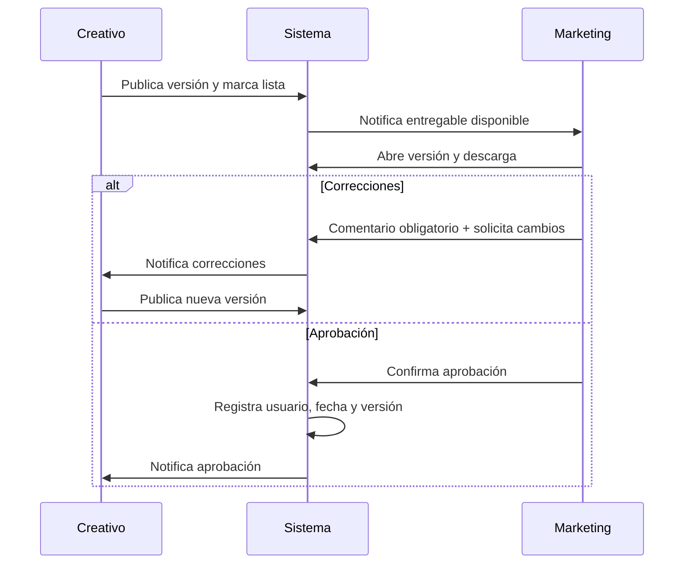

# 8. Revisión y aprobación

## Revisión

Marketing ve archivo, versión, fecha, autor, comentarios y relación con la solicitud. Puede comentar sobre el entregable o marcar el archivo relacionado; la zona específica puede ser un dato de anotación futuro, no requisito inicial.

## Correcciones

Comentario obligatorio, estado `Correcciones solicitadas`, notificación al responsable y registro en historial. El creativo no sobrescribe una versión aprobada: crea una nueva versión vinculada.

## Aprobación

Requiere confirmación explícita y bloquea modificaciones accidentales sobre esa versión. La solicitud pasa a `Aprobada`; el cierre a `Finalizada` ocurre cuando existe entregable aprobado y el supervisor/sistema confirma condiciones.

## Reversión

Recomendación: Marketing no revierte una aprobación. Supervisor o administrador puede reabrirla excepcionalmente con motivo obligatorio, permiso especial y auditoría completa.
