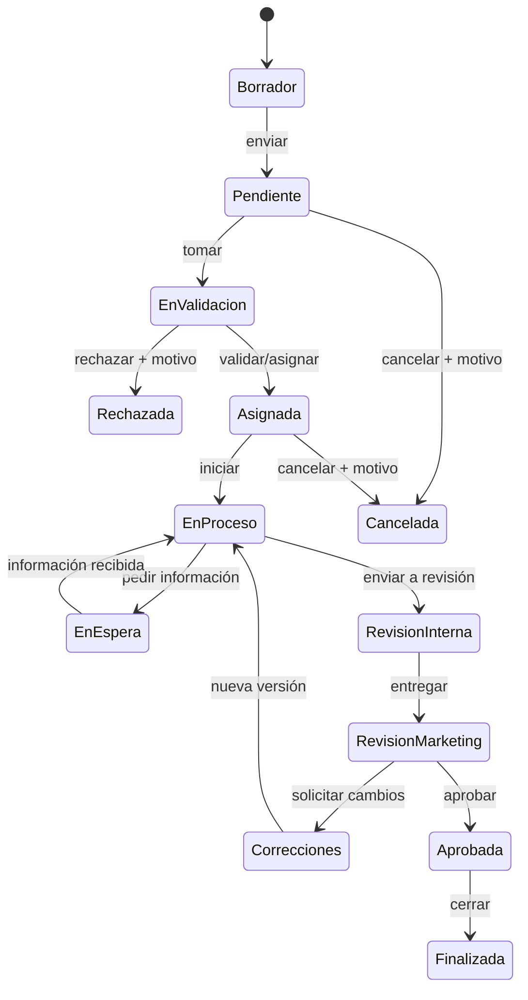

# 9. Ciclo de vida y máquina de estados

| Estado | Significado | Quién lo coloca | Pausa tiempo | Comentario |
|---|---|---|---|---|
| Borrador | Incompleta y no enviada | Marketing | No aplica | No |
| Pendiente | Recibida, sin validar | Sistema/Marketing | No | No |
| En validación | Revisión de alcance | Supervisor/equipo | No | Si rechaza |
| Asignada | Tiene responsable | Supervisor | No | Motivo si reasigna |
| En proceso | Producción activa | Creativo | No | No |
| En espera de información | Bloqueada por datos | Creativo | Sí | Sí, qué falta |
| En revisión interna | Control antes de enviar | Creativo/supervisor | No | No |
| En revisión de Marketing | Entregable disponible | Creativo | No | No |
| Correcciones solicitadas | Cambios pedidos | Marketing | No | Sí, cambios |
| Aprobada | Versión aceptada | Marketing | No | Confirmación |
| Finalizada | Trabajo cerrado | Sistema/supervisor | No | No |
| Cancelada | Interrumpida | Marketing/supervisor/admin | No | Sí, motivo |
| Rechazada | No procede | Supervisor/admin | No | Sí, motivo |

No se permiten saltos libres. El backend debe validar origen, destino, rol y condiciones; cada transición genera historial y notificación cuando corresponda.
